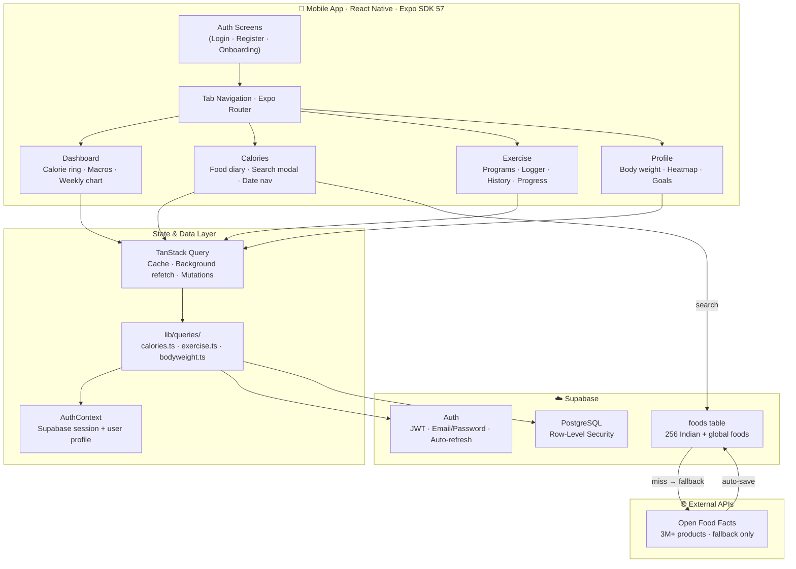
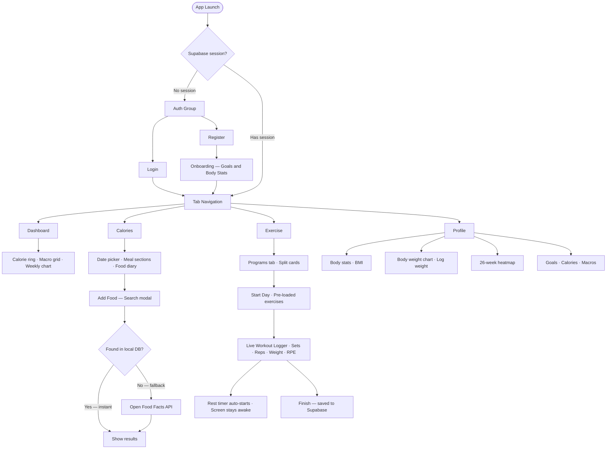
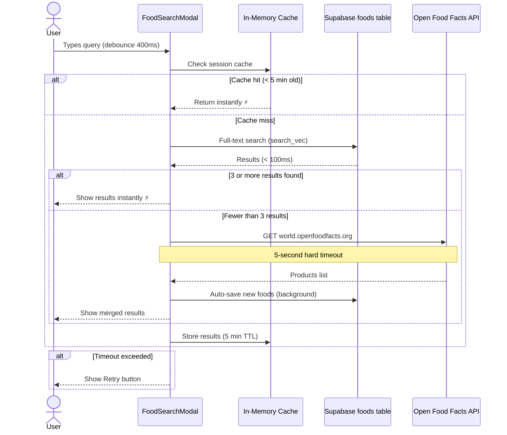
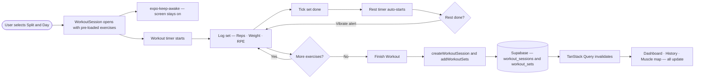
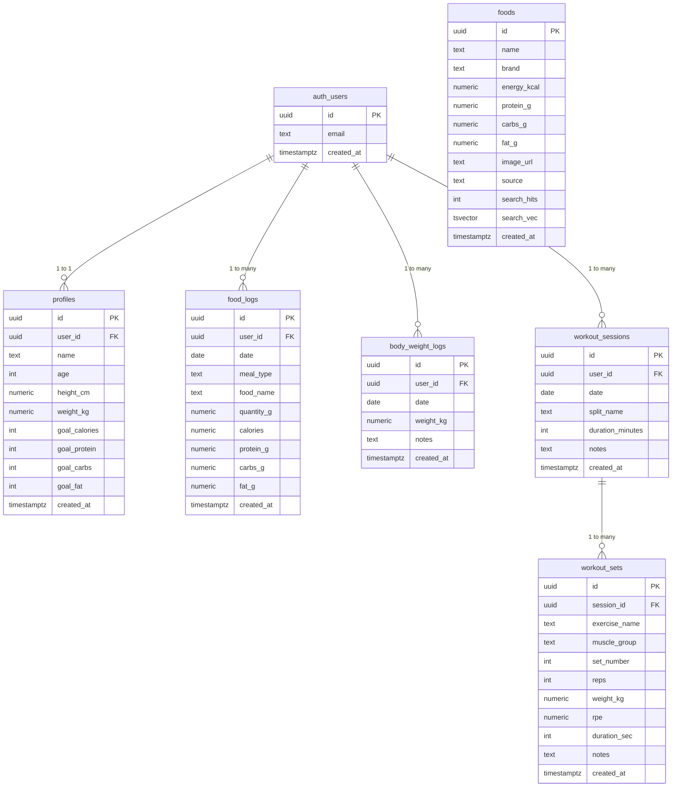

# CaloriTracker

> A professional cross-platform health & fitness mobile app for iOS and Android — built with React Native (Expo), Supabase, and open-source nutrition & exercise data.


---

## Table of Contents

1. [Overview](#overview)
2. [Architecture](#architecture)
3. [User Flow](#user-flow)
4. [Food Search Flow](#food-search-flow)
5. [Workout Logging Flow](#workout-logging-flow)
6. [Database Schema](#database-schema)
7. [Features](#features)
8. [Tech Stack](#tech-stack)
9. [Project Structure](#project-structure)
10. [Setup Guide](#setup-guide)
11. [Workout Splits](#workout-splits)
12. [Data Sources](#data-sources)

---

## Overview

CaloriTracker is a full-featured personal health companion that combines nutrition tracking, structured workout programs, and body analytics in a single polished mobile app.

**Core capabilities:**

- 🍎 Track daily **calorie & macro intake** across 4 meal types with a searchable food diary
- ⚡ **Instant food search** — searches a local Supabase DB of 256 Indian & global foods first, falls back to Open Food Facts and auto-saves results
- 💪 Follow structured **workout splits** (PPL, Upper/Lower, Arnold, Full Body, and more)
- 📋 Pre-loaded exercise lists per split day — start logging immediately, no manual searching
- ⏱️ **Live workout logger** with set/rep/weight/RPE tracking and an auto-start rest timer
- ⚖️ **Body weight tracking** with a smooth trend chart and goal weight line
- 🗓️ **Activity heatmap** — GitHub-style 26-week training calendar
- 🧠 **1RM Calculator** (Epley formula) with percentage breakdown by training goal
- 🗺️ **Muscle map** — front/back SVG body diagram shaded by weekly training volume
- 📈 **Strength progress charts** per exercise with personal record badges

All data is stored in your own **Supabase PostgreSQL** instance with Row-Level Security — nobody else can see your data.

---

## Architecture



---

## User Flow



---

## Food Search Flow



---

## Workout Logging Flow



---

## Database Schema



> Row-Level Security is enforced on **all tables**: `auth.uid() = user_id` — users can only access their own rows.

---

## Features

### 🍎 Calorie Tracker
- **Food Diary** — Breakfast, Lunch, Dinner, Snacks with per-meal calorie totals
- **Smart Food Search** — searches local DB of 256 Indian + global foods first (instant), falls back to Open Food Facts (3M+ products), auto-saves new finds
- **Date Navigation** — browse any past or future date
- **Macro Donut Chart** — protein / carbs / fat ring with % of daily goal
- **Gradient Progress Bar** — green → red as you approach/exceed goal
- **Macro Boxes** — at-a-glance P/C/F with mini progress bars

### 💪 Exercise Tracker
- **6 Workout Programs** — PPL, Upper/Lower, Full Body, Arnold, Bro Split, PHUL
- **Pre-loaded Exercises** — tap Start on a split day and all exercises appear instantly
- **Live Workout Logger** — sets, reps, weight, and optional RPE (effort 1–10) per set
- **Auto Rest Timer** — starts counting down when you tick a set done (60/90/120/180s presets), vibrates when rest ends
- **Screen Stay-Awake** — `expo-keep-awake` keeps display on during sessions
- **Workout History** — volume, set count, duration, exercise tags per session
- **Strength Progress Charts** — SVG line chart per exercise with trend over time
- **Personal Records** — auto-detected PR per exercise with estimated 1RM badge

### 🧠 1RM Calculator
- **Epley formula** — estimates your one-rep max from any set of ≤12 reps
- **Percentage table** — shows target weight at 60 / 70 / 80 / 90 / 100% with training-goal labels
- **Plain-English explainer** — any user understands what 1RM means and why it matters

### 🗺️ Muscle Map
- **Front / Back SVG body diagram** — anatomically placed overlays on a human silhouette
- **Volume shading** — green intensity reflects sets logged per muscle group in the last 7 days
- **Trained / Needs Work legend** — shows exactly which muscles you've neglected

### 📊 Dashboard
- **Hero Calorie Ring** — large donut with % of goal, gradient progress bar, remaining kcal
- **Macro Grid** — protein, carbs, fat boxes with per-macro mini progress bars
- **Gradient Quick Actions** — one-tap to food diary or start a workout
- **Weekly Bar Chart** — 7-day gradient bars (green = today, red = over goal)

### ⚖️ Body Weight Tracking
- **Daily weigh-in** — log once per day via Profile screen
- **Trend chart** — smooth cubic Bézier line with gradient fill and goal weight dashed line
- **Delta label** — shows total gain/loss across all entries
- **Upsert logic** — editing the same day overwrites instead of duplicating

### 🗓️ Activity Heatmap
- **26-week GitHub-style calendar** — one cell per day, green for workout days
- **Month labels** auto-position across the top
- **Today highlight** — green border on today's cell

---

## Tech Stack

| Layer | Technology | Purpose |
|---|---|---|
| Framework | React Native + Expo SDK 57 | Cross-platform iOS + Android |
| Language | TypeScript (strict) | Type safety throughout |
| Navigation | Expo Router v4 (file-based) | Auth guard, tabs, stacks |
| Styling | NativeWind v4 (Tailwind CSS) | Utility-first mobile styling |
| Gradients | expo-linear-gradient | Headers, cards, buttons, charts |
| Screen Lock | expo-keep-awake | Keep display on during workouts |
| Backend | Supabase Auth + PostgreSQL | Auth, database, Row-Level Security |
| Data Fetching | TanStack Query v5 | Cache, background refresh, mutations |
| Charts | react-native-svg | Donut ring, bar chart, line chart, muscle map |
| Food DB | Supabase `foods` table | 256 Indian + global foods, instant search |
| Food Fallback | Open Food Facts API | 3M+ products, open source, no key needed |
| Exercise Data | free-exercise-db (MIT) | 55 exercises bundled as JSON |
| Storage | @react-native-async-storage | Supabase session persistence |

---

## Project Structure

```
CaloriTracker/
├── app/
│   ├── _layout.tsx                  Root: providers + AuthGate redirect
│   ├── (auth)/
│   │   ├── _layout.tsx              Auth stack layout
│   │   ├── login.tsx                Gradient login form
│   │   ├── register.tsx             Registration with validation
│   │   └── onboarding.tsx           Multi-step goal + body stat setup
│   └── (tabs)/
│       ├── _layout.tsx              Bottom tab bar (pill active indicator)
│       ├── index.tsx                Dashboard
│       ├── calories.tsx             Food diary
│       ├── exercise.tsx             Exercise tracker
│       └── profile.tsx              Profile + body weight + heatmap
│
├── components/
│   ├── ui/
│   │   ├── Button.tsx               Gradient · ghost · danger · secondary
│   │   ├── Card.tsx                 White card with 3 shadow tiers
│   │   └── Input.tsx                Labelled input with icon + error state
│   ├── calories/
│   │   ├── MacroDonut.tsx           SVG ring — protein/carbs/fat segments
│   │   ├── MealSection.tsx          Per-meal list with gradient icons
│   │   ├── FoodSearchModal.tsx      Smart search: local DB → OFF fallback
│   │   └── CalorieProgressBar.tsx   Horizontal bar with colour states
│   ├── exercise/
│   │   ├── SplitCard.tsx            Gradient program card + day plan
│   │   ├── WorkoutSession.tsx       Live logger: sets/reps/weight/RPE
│   │   ├── ExerciseSearch.tsx       Search + muscle group filter
│   │   ├── ProgressChart.tsx        SVG line chart for strength over time
│   │   └── MuscleMap.tsx            Front/back SVG body with intensity overlays
│   └── profile/
│       ├── BodyWeightChart.tsx      Bézier trend line + goal dashed line
│       └── ActivityHeatmap.tsx      26-week GitHub-style training calendar
│
├── lib/
│   ├── context/
│   │   └── AuthContext.tsx          Supabase session · profile · signIn/Out/Up
│   ├── queries/
│   │   ├── calories.ts              CRUD food_logs · smart food search cascade
│   │   ├── exercise.ts              CRUD workout_sessions + sets + progress
│   │   └── bodyweight.ts            CRUD body_weight_logs + latest weight
│   ├── data/
│   │   ├── splits.ts                6 workout split definitions
│   │   ├── exercises.json           55 exercises with muscle groups + GIF URLs
│   │   └── foods-seed.ts            256 Indian + global foods (seed source)
│   ├── supabase.ts                  Supabase client (AsyncStorage session)
│   └── types.ts                     All TypeScript interfaces and types
│
├── scripts/
│   ├── seed-foods.sql               Run once in Supabase SQL Editor to seed foods
│   └── generate-sql.js              Generates seed-foods.sql from foods-seed.ts
│
├── supabase/
│   └── migrations/
│       ├── 001_init.sql             Core schema: profiles, food_logs, sessions, sets
│       └── 002_bodyweight_rpe.sql   body_weight_logs + rpe/notes columns
│
├── .env.example                     Environment variable template
├── app.json                         Expo config
├── babel.config.js                  NativeWind JSX transform
├── metro.config.js                  Metro + NativeWind CSS pipeline
├── tailwind.config.js               Tailwind theme + custom palette
└── tsconfig.json
```

---

## Setup Guide

### Prerequisites

- **Node.js** 22+
- A free **[Supabase](https://supabase.com)** account
- **[Expo Go](https://expo.dev/client)** on your phone — or Android Studio for a development build

### Step 1 — Clone and install

```bash
git clone <your-repo-url>
cd CaloriTracker
npm install
```

### Step 2 — Create a Supabase project

1. Go to [supabase.com](https://supabase.com) → **New Project**
2. Navigate to **Settings → API**
3. Copy your **Project URL** and **anon/public** key

### Step 3 — Configure environment variables

```env
# .env
EXPO_PUBLIC_SUPABASE_URL=https://your-project.supabase.co
EXPO_PUBLIC_SUPABASE_ANON_KEY=your-anon-key-here
```

### Step 4 — Run database migrations

In **Supabase → SQL Editor**, run in order:

```
supabase/migrations/001_init.sql
supabase/migrations/002_bodyweight_rpe.sql
```

Then create the foods table and seed it:

```sql
-- 1. Create foods table (copy from SQL Editor)
CREATE TABLE IF NOT EXISTS foods (
  id           UUID PRIMARY KEY DEFAULT gen_random_uuid(),
  name         TEXT NOT NULL,
  brand        TEXT DEFAULT '',
  energy_kcal  NUMERIC NOT NULL DEFAULT 0,
  protein_g    NUMERIC NOT NULL DEFAULT 0,
  carbs_g      NUMERIC NOT NULL DEFAULT 0,
  fat_g        NUMERIC NOT NULL DEFAULT 0,
  image_url    TEXT,
  source       TEXT NOT NULL DEFAULT 'seed',
  search_hits  INTEGER NOT NULL DEFAULT 0,
  created_at   TIMESTAMPTZ NOT NULL DEFAULT NOW(),
  search_vec   TSVECTOR GENERATED ALWAYS AS (to_tsvector('simple', name || ' ' || COALESCE(brand,''))) STORED
);
CREATE INDEX IF NOT EXISTS foods_search_vec_idx ON foods USING GIN(search_vec);
CREATE INDEX IF NOT EXISTS foods_name_idx ON foods (LOWER(name) text_pattern_ops);
ALTER TABLE foods ENABLE ROW LEVEL SECURITY;
CREATE POLICY "foods_read_all" ON foods FOR SELECT USING (true);
CREATE POLICY "foods_insert_auth" ON foods FOR INSERT WITH CHECK (true);
CREATE POLICY "foods_update_hits" ON foods FOR UPDATE USING (true);
ALTER TABLE foods ADD CONSTRAINT foods_name_unique UNIQUE (name);

-- 2. Helper function for search popularity
CREATE OR REPLACE FUNCTION increment_food_hits(food_name TEXT)
RETURNS void LANGUAGE sql AS $$
  UPDATE foods SET search_hits = search_hits + 1
  WHERE LOWER(name) LIKE '%' || LOWER(food_name) || '%';
$$;
```

Then paste and run `scripts/seed-foods.sql` to load 256 foods.

### Step 5 — Start the app

```bash
npx expo start
```

Connect your phone to the same Wi-Fi as your PC and scan the QR code with Expo Go.

---

## Workout Splits

| Program | Days/week | Level | Best For |
|---|---|---|---|
| Push / Pull / Legs (PPL) | 6 | Intermediate | High-frequency hypertrophy |
| Upper / Lower | 4 | Intermediate | Balanced strength + size |
| Full Body | 3 | Beginner | New lifters, general fitness |
| Arnold Split | 6 | Advanced | Classic bodybuilding |
| Bro Split | 5 | Intermediate | Focused isolation per muscle |
| PHUL (Power Hypertrophy) | 4 | Intermediate | Strength + size combined |

Each split includes a day-by-day breakdown with target muscle groups and a pre-loaded exercise list that auto-populates when you start a session.

---

## Data Sources

| Source | License | Usage |
|---|---|---|
| [Open Food Facts](https://world.openfoodfacts.org/) | ODbL | Food search fallback — 3M+ products, no API key |
| [IFCT 2017 / NIN India](https://www.nin.res.in/) | Public domain | Nutritional values for Indian foods in seed DB |
| [USDA FoodData Central](https://fdc.nal.usda.gov/) | Public domain | Nutritional values for global staples in seed DB |
| [free-exercise-db](https://github.com/yuhonas/free-exercise-db) | MIT | 55 exercises bundled as JSON, used offline |
| [hasaneyldrm/exercises-dataset](https://github.com/hasaneyldrm/exercises-dataset) | MIT (code) · © Gym Visual (media) | Exercise GIFs/thumbnails via CDN |
| [openGym](https://github.com/arvids-unavailable/openGym) | AGPL v3 | UI/UX inspiration only — no code copied |
| [Supabase](https://supabase.com) | Apache 2.0 | Auth, PostgreSQL database, RLS |

---

## Environment Variables

| Variable | Description | Where to find |
|---|---|---|
| `EXPO_PUBLIC_SUPABASE_URL` | Supabase project URL | Settings → API → Project URL |
| `EXPO_PUBLIC_SUPABASE_ANON_KEY` | Supabase anon/public key | Settings → API → anon key |
